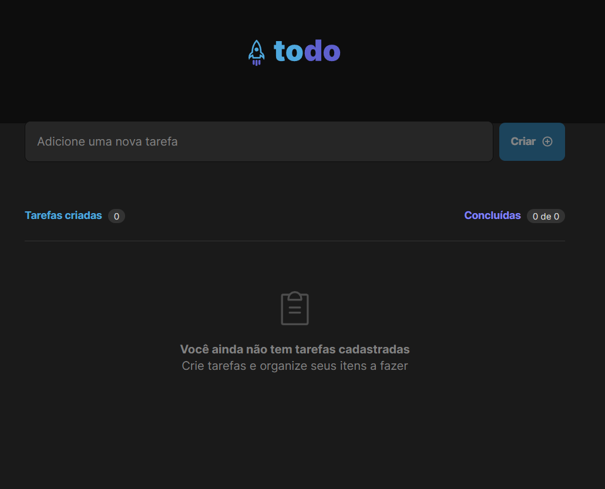
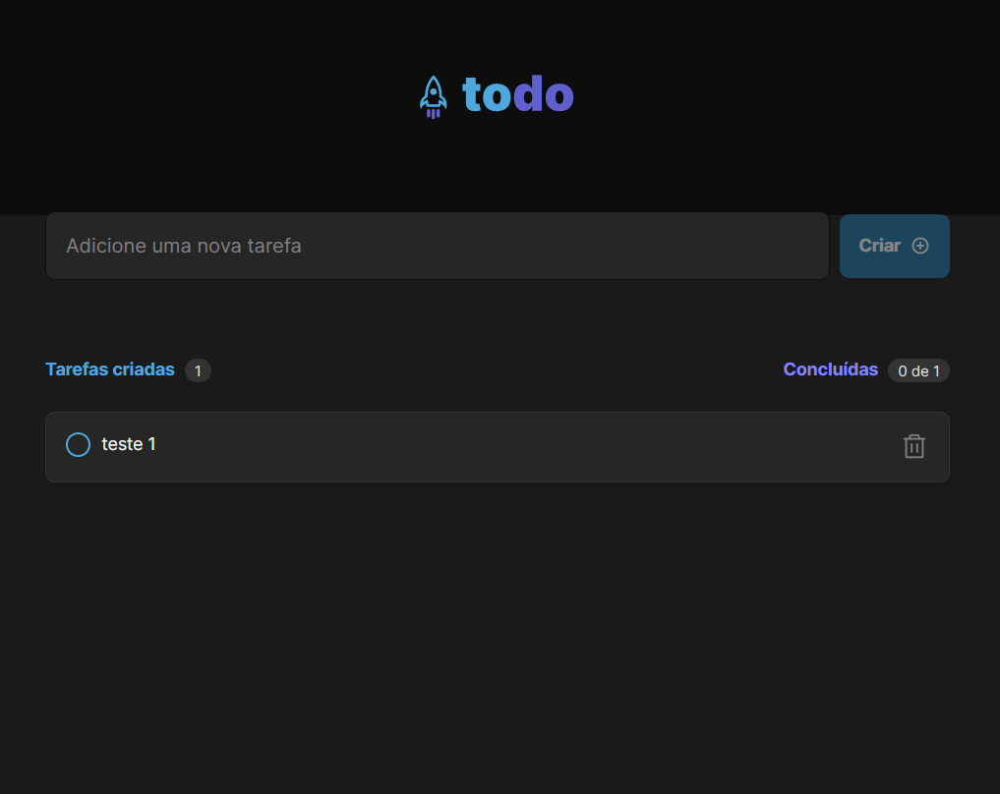
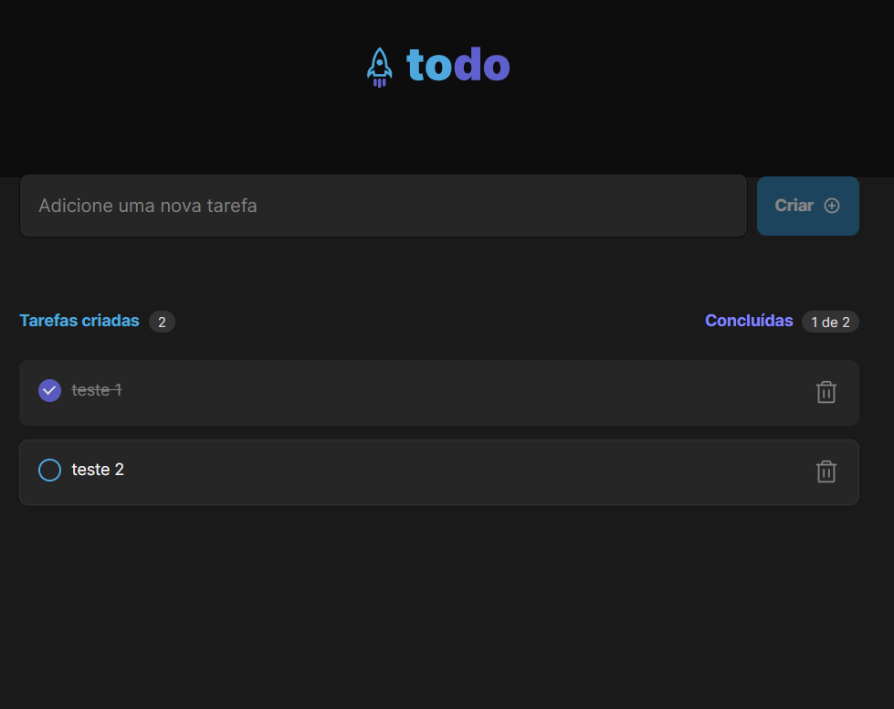
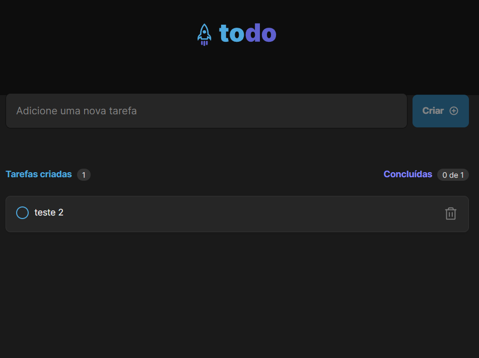

<h1 align="center"> ToDo List </h1>

<h3 align="center"> 
	🚧  React Vite 🚀 Finalizado  🚧
</h3> 

Programa exclusivo do ignite, promovido pela Rocketseat para ensino de tecnologias WEB. Desafio 01 

  <a href="#-tecnologias">Tecnologias</a>&nbsp;&nbsp;&nbsp;|&nbsp;&nbsp;&nbsp;
  <a href="#-projeto">Projeto</a>&nbsp;&nbsp;&nbsp;|&nbsp;&nbsp;&nbsp;
  <a href="#memo-licença">Licença</a>

  

 

  

## 🚀 Tecnologias

Esse projeto foi desenvolvido com as seguintes tecnologias:

- HTML e CSS
- JavaScript / TypeScript
- Git e Github
- [Vite / React.js](https://vitejs.dev/guide/)
- [Phosphor Icons](https://www.npmjs.com/package/phosphor-react)
- [UUID](https://www.npmjs.com/package/uuid)

## 💻 Projeto

Esse projeto tem como intuito passar no primeiro teste da rocketseat onde botamos em prática tudo que foi nos ensinados no decorrer do primeiro modulo, estilizando paginas, criando componentes, utilizando o conceito de estado.

  

  

  

  

- [Acesse o projeto finalizado, online](https://tuiusx.github.io/todo-list/)

## Sobre o desafio

Nesse desafio, você vai desenvolver uma aplicação de controle de tarefas no estilo **to-do list**, que contém as seguintes funcionalidades:

- Adicionar uma nova tarefa
- Marcar e desmarcar uma tarefa como concluída
- Remover uma tarefa da listagem
- Mostrar o progresso de conclusão das tarefas

Apesar de serem poucas funcionalidades, você vai precisar relembrar conceitos como:

- Estados
- Imutabilidade do estado
- Listas e chaves no ReactJS
- Propriedades
- Componentização

## :memo: Licença

Esse projeto está sob a licença MIT.

---

Feito com ♥ por Ricardo Martins 

